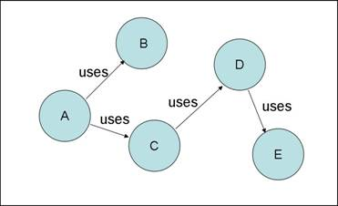
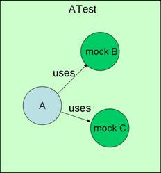

**什么是 Mock 测试**

Mock 测试就是在测试过程中，对于某些不容易构造（如 HttpServletRequest 必须在Servlet 容器中才能构造出来）或者不容易获取比较复杂的对象（如 JDBC 中的ResultSet 对象），用一个虚拟的对象（Mock 对象）来创建以便测试的测试方法。

Mock 最大的功能是帮你把单元测试的耦合分解开，如果你的代码对另一个类或者接口有依赖，它能够帮你模拟这些依赖，并帮你验证所调用的依赖的行为。

比如一段代码有这样的依赖：

当我们需要测试A类的时候，如果没有 Mock，则我们需要把整个依赖树都构建出来，而使用 Mock 的话就可以将结构分解开，像下面这样：

**Mock 对象使用范畴**

真实对象具有不可确定的行为，产生不可预测的效果（如：股票行情，天气预报）：

* 真实对象很难被创建的
* 真实对象的某些行为很难被触发
* 真实对象实际上还不存在的（和其他开发小组或者和新的硬件打交道）等等

**使用 Mock 对象测试的关键步骤**
* 使用一个接口来描述这个对象
* 在产品代码中实现这个接口
* 在测试代码中实现这个接口
* 在被测试代码中只是通过接口来引用对象，所以它不知道这个引用的对象是真实对象，还是 Mock 对象。

**Mock 与 Stub 的区别**
Mock 不是 Stub，两者是有区别的：
* 前者被称为 mockist TDD，而后者一般称为 classic TDD ；
* 前者是基于行为的验证（behavior verification），后者是基于状态的验证 （state verification）；
* 前者使用的是模拟的对象，而后者使用的是真实的对象。

-------
*摘：* 
描述：[https://www.cnblogs.com/bodhitree/p/9456515.html]() 
代码：[https://www.cnblogs.com/Ming8006/p/6297333.html]()